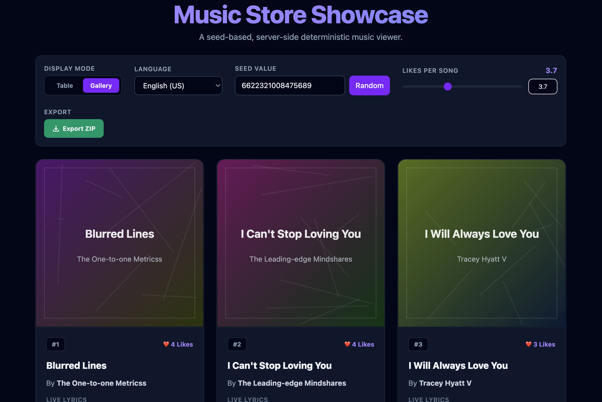

# 🎵 BeatWave Market - Music Store Showcase

A high-performance, single-page monorepo web application that simulates a music store showcase. It dynamically generates realistic song lists, covers, reviews, and synthesizes playable, reproducible audio tracks directly in the browser—all powered by **server-side deterministic generation** with **zero persistent databases**.

---

## 🎨 Visual Showcase

<p align="center">
  
</p>

---

## 🔗 Live Deployments

- **⚡ Frontend (Netlify SPA):** [https://spectacular-biscotti-b54d5c.netlify.app](https://spectacular-biscotti-b54d5c.netlify.app)

---

## 🛡️ Technical Architecture & Key Features

### 1. Zero-Database Server-Side Deterministic Generation

- **The Principle:** No random data is stored on a database. Instead, data is calculated on-the-fly by the Node.js server.
- **The Seed:** Combining a user-defined 64-bit seed and the record's absolute page index allows the **RNG (Random Number Generator)** algorithm to construct identical, reproducible data streams for any client at any time.

### 2. Multi-Language / Region Support (Locale Isolation)

- Supports English (US) and German (Germany).
- **extensible Design:** Reviews, lyrics, and metadata contain zero hardcoded translations in the javascript logic. All languages are isolated into external JSON files under `/locales`. Adding a new region is as simple as dropping a new JSON file into the folder.

### 3. Dynamic Audio Synthesis (Web Audio API)

- Melody tracks, BPM tempo, scale types (Major/Minor), and synth styles are composed deterministically on the backend.
- The frontend uses a custom scheduling pipeline built on browser-native **Web Audio API** oscillators to generate sounds in real-time, complete with volume attack/decay envelopes to prevent speaker clicks.
- Supports live synthesizer toggling (Sine, Triangle, Sawtooth), volume adjustments, and timeline seeking (jumping to any elapsed offset).

### 4. High-Performance Views

- **Table View:** Structured spreadsheet layout with full pagination and collapsible row details displaying cover SVG designs and album reviews.
- **Gallery View:** Responsive 3-column album card grid featuring an optimized **Infinite Scroll** loader using the native browser **`IntersectionObserver` API** instead of heavy scroll listener packages.

---

## 📁 Repository Directory Structure

```text
music-store-showcase/ (Monorepo Root)
├── Instructions/                 # Detailed step-by-step guides in Bangla
│   ├── project/                  # Global architecture & deployment configurations
│   ├── backend/                  # Server-side setup & audio synthesis guides
│   └── frontend/                 # React UI, component states & player designs
├── backend/                      # Node.js + Express Server API
│   ├── src/
│   │   ├── locales/              # JSON-based localization datasets (en.json, de.json)
│   │   ├── utils/                # Seeded RNG generator & PCM audio buffer encoder
│   │   └── server.js             # Main server router & CORS controller
│   └── vercel.json               # Serverless function router for Vercel
└── frontend/                     # React + Vite + Tailwind CSS Client
    ├── public/
    │   └── _redirects            # Netlify SPA client fallback routing redirects
    └── src/
        ├── components/           # TableView, GalleryView, Toolbar, PlayerBar components
        ├── utils/                # Dynamic API client & Web Audio API synthesizers
        └── App.jsx               # Main state machine & layouts orchestrator
```

---

## 🛠️ Development & Installation Setup

To run this project locally, clone this repository and configure the frontend and backend folders separately.

### 1. Local Backend Setup

1.  Navigate to the `backend` folder:
    ```bash
    cd backend
    ```
2.  Install dependencies:
    ```bash
    npm install
    ```
3.  Start the development server:
    ```bash
    npm run dev
    ```
    _The server runs locally at `http://localhost:4000`._

### 2. Local Frontend Setup

1.  Navigate to the `frontend` folder:
    ```bash
    cd ../frontend
    ```
2.  Install dependencies:
    ```bash
    npm install
    ```
3.  Start the Vite developer server:
    ```bash
    npm run dev
    ```
    _The client app runs locally at `http://localhost:5173`. It automatically maps all API calls to your local backend on port 4000._

---

## 🌐 Production Builds & Deployment Info

### Backend Deployment (Vercel)

The backend is structured to compile as a Serverless function. Vercel utilizes the [vercel.json](backend/vercel.json) file to route all paths to the Express listener:

- Build Command: Automatic detection.
- Deploy: Navigate to `backend` and run `vercel --prod`.

### Frontend Deployment (Netlify)

The frontend builds into a static SPA. It uses [\_redirects](frontend/public/_redirects) to fallback route reloads to `index.html`:

- **Base Directory:** `frontend`
- **Build Command:** `npm run build`
- **Publish Directory:** `dist`
- **Dynamic API Switching:** The app checks the active browser hostname. If on `localhost`, it targets port `4000`. If hosted, it automatically routes calls to the live Vercel URL, requiring **zero environment variable settings**.
